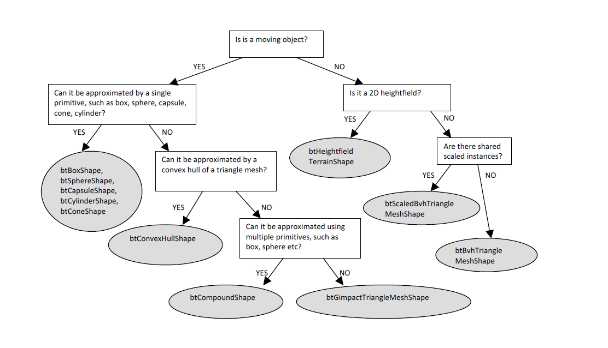

#Bullet 2.83 Physics SDK Manual
##4 Bullet Collision Detection
###Collision Detection
The collision detection provides algorithms and acceleration structures for closest point (distance and
penetration) queries as well as ray and convex sweep tests. The main data structures are:

• btCollisionObject is the object that has a world transform and a collision shape.
• btCollisionShape describes the collision shape of a collision object, such as box, sphere, convex hull or triangle mesh. A single collision shape can be shared among multiple collision objects.
• btGhostObject is a special btCollisionObject, useful for fast localized collision queries.
• btCollisionWorld stores all btCollisionObjects and provides an interface to perform queries.

The broadphase collision detection provides acceleration structure to quickly reject pairs of objects
based on axis aligned bounding box (AABB) overlap. Several different broadphase acceleration
structures are available:

• btDbvtBroadphase uses a fast dynamic bounding volume hierarchy based on AABB tree
• btAxisSweep3 and bt32BitAxisSweep3 implement incremental 3d sweep and prune
• btSimpleBroadphase is a brute force reference implementation. It is slow but easy to understand and useful for debugging and testing a more advanced broadphase.

The broadphase adds and removes overlapping pairs from a pair cache. Overlapping pairs are persistent over time and can cache information such as previous contact constraint forces that can be used for ‘warmstarting’: using the previous solution to converge faster towards constraint solving. 

A collision dispatcher iterates over each pair, searches for a matching collision algorithm based on the types of objects involved and executes the collision algorithm computing contact points.
• btPersistentManifold is a contact point cache to store contact points for a given pair of objects.
###Collision Shapes
Bullet supports a large variety of different collision shapes, and it is possible to add your own. For best
performance and quality it is important to choose the collision shape that suits your purpose. The
following diagram can help making a decision:

###Convex Primitives
Most primitive shapes are centered around the origin of their local coordinate frame:

btBoxShape : Box defined by the half extents (half length) of its sides

btSphereShape : Sphere defined by its radius

btCapsuleShape: Capsule around the Y axis. Also btCapsuleShapeX/Z

btCylinderShape : Cylinder around the Y axis. Also btCylinderShapeX/Z.

btConeShape : Cone around the Y axis. Also btConeShapeX/Z.

btMultiSphereShape : Convex hull of multiple spheres, that can be used to create a Capsule (by

passing 2 spheres) or other convex shapes.
###Compound Shapes
Multiple convex shapes can be combined into a composite or compound shape, using the
btCompoundShape. This is a concave shape made out of convex sub parts, called child shapes. Each
child shape has its own local offset transform, relative to the btCompoundShape. It is a good idea to
approximate concave shapes using a collection of convex hulls, and store them in a
btCompoundShape. You can adjust the center of mass using a utility method btCompoundShape
::calculatePrincipalAxisTransform.
###Convex Hull Shapes
Bullet supports several ways to represent a convex triangle meshes. The easiest way is to create a
btConvexHullShape and pass in an array of vertices. In some cases the graphics mesh contains too
many vertices to be used directly as btConvexHullShape. In that case, try to reduce the number of
vertices.
###Concave Triangle Meshes
For static world environment, a very efficient way to represent static triangle meshes is to use a
btBvhTriangleMeshShape. This collision shape builds an internal acceleration structure from a
btTriangleMesh or btStridingMeshInterface. Instead of building the tree at run-time, it is
also possible to serialize the binary tree to disc. See examples/ConcaveDemo how to save and load
this btOptimizedBvh tree acceleration structure. When you have several instances of the same
triangle mesh, but with different scaling, you can instance a btBvhTriangleMeshShape multiple
times using the btScaledBvhTriangleMeshShape. The btBvhTriangleMeshShape can store
multiple mesh parts. It keeps a triangle index and part index in a 32bit structure, reserving 10 bits for
the part Id and the remaining 22 bits for triangle index. If you need more than 2 million triangles,
either split the the triangle mesh into multiple sub meshes, or change the default in #define
MAX_NUM_PARTS_IN_BITS in the file

    src\BulletCollision\BroadphaseCollision\btQuantizedBvh.h
###Convex Decomposition
Ideally, concave meshes should only be used for static artwork. Otherwise its convex hull should be
used by passing the mesh to btConvexHullShape. If a single convex shape is not detailed enough,
multiple convex parts can be combined into a composite object called btCompoundShape. Convex
decomposition can be used to decompose the concave mesh into several convex parts. See the
Demos/ConvexDecompositionDemo for an automatic way of doing convex decomposition.
###Height field
Bullet provides support for the special case of a flat 2D concave terrain through the
btHeightfieldTerrainShape. See examples/TerrainDemo for its usage.
###btStaticPlaneShape
As the name suggests, the btStaticPlaneShape can represent an infinite plane or half space. This
shape can only be used for static, non-moving objects. This shape has been introduced mainly for
demo purposes.
###Scaling of Collision Shapes
Some collision shapes can have local scaling applied. Use
btCollisionShape::setScaling(vector3). Non uniform scaling with different scaling values for
each axis, can be used for btBoxShape, btMultiSphereShape, btConvexShape,
btTriangleMeshShape. Uniform scaling, using x value for all axis, can be used for
btSphereShape. Note that a non-uniform scaled sphere can be created by using a
btMultiSphereShape with 1 sphere. As mentioned before, the
btScaledBvhTriangleMeshShape allows to instantiate a btBvhTriangleMeshShape at different
non-uniform scale factors. The btUniformScalingShape allows to instantiate convex shapes at
different scales, reducing the amount of memory.
###Collision Margin
Bullet uses a small collision margin for collision shapes, to improve performance and reliability of the
collision detection. It is best not to modify the default collision margin, and if you do use a positive
value: zero margin might introduce problems. By default this collision margin is set to 0.04, which is 4
centimeter if your units are in meters (recommended).
Dependent on which collision shapes, the margin has different meaning. Generally the collision
margin will expand the object. This will create a small gap. To compensate for this, some shapes will
subtract the margin from the actual size. For example, the btBoxShape subtracts the collision margin
from the half extents. For a btSphereShape, the entire radius is collision margin so no gap will
occur. Don’t override the collision margin for spheres. For convex hulls, cylinders and cones, the
margin is added to the extents of the object, so a gap will occur, unless you adjust the graphics mesh
or collision size. For convex hull objects, there is a method to remove the gap introduced by the
margin, by shrinking the object. See the examples/Importers/ImportBsp for this advanced use.

###Collision Matrix
For each pair of shape types, Bullet will dispatch a certain collision algorithm, by using the dispatcher.
By default, the entire matrix is filled with the following algorithms. Note that Convex represents
convex polyhedron, cylinder, cone and capsule and other GJK compatible primitives. GJK stands for
Gilbert, Johnson and Keerthi, the people behind this convex distance calculation algorithm. It is
combined with EPA for penetration depth calculation. EPA stands for Expanding Polythope
Algorithm by Gino van den Bergen. Bullet has its own free implementation of GJK and EPA.

###Registering custom collision shapes and algorithms
The user can register a custom collision detection algorithm and override any entry in this Collision
Matrix by using the btDispatcher::registerCollisionAlgorithm. See
examples/UserCollisionAlgorithm for an example, that registers a SphereSphere collision
algorithm.
